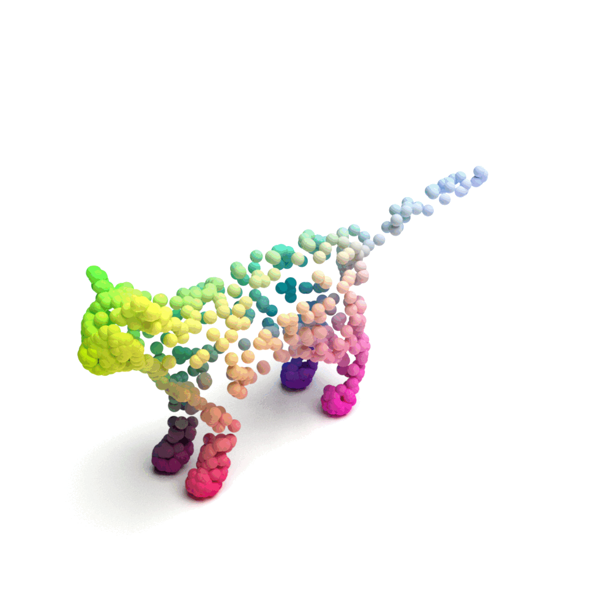
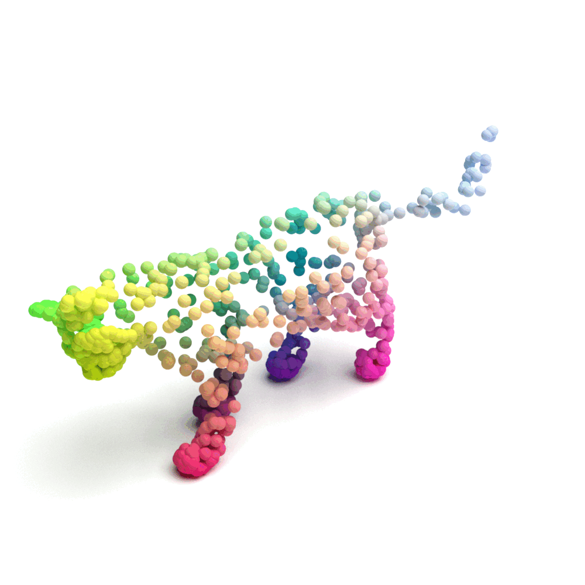
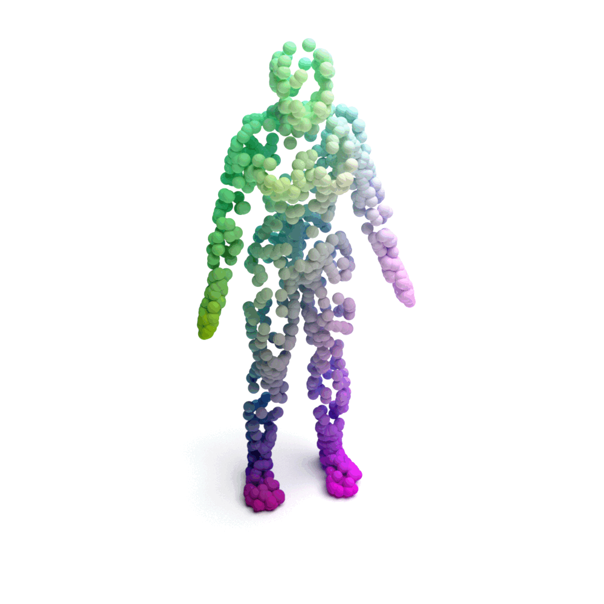
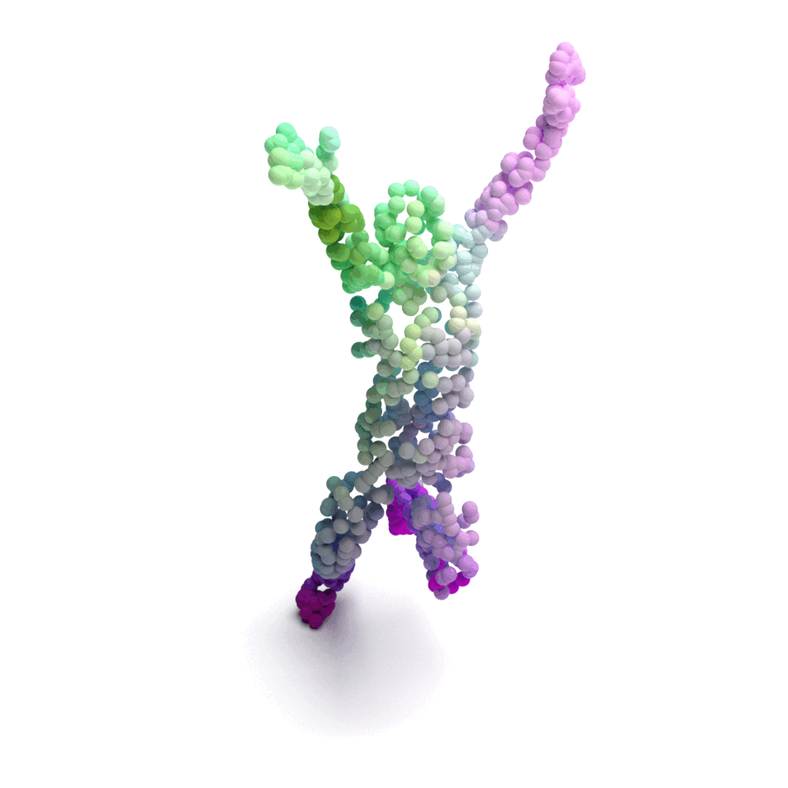

## SE-ORNet: Self-Ensembling Orientation-aware Network for Unsupervised Point Cloud Shape Correspondence
PyTorch implementation for our CVPR 2023 paper SE-ORNet.

[](https://paperswithcode.com/sota/3d-dense-shape-correspondence-on-shrec-19?p=se-ornet-self-ensembling-orientation-aware)

<a href="https://pytorch.org/get-started/locally/"></a>
<a href="https://pytorchlightning.ai/"></a>

<div>
    
    
    
    
</div>

<div>
    
    
    
    
</div>

[[Project Webpage](https://chuxwa.github.io/SE-ORNet/)]
[[Paper](https://arxiv.org/abs/2304.05395)]

## News

* **28. February 2023**: SE-ORNet is accepted at CVPR 2023. :fire:
* **10. April 2023**: [SE-ORNet preprint](https://arxiv.org/abs/2304.05395) released on arXiv.
* **Coming Soon**: Code will be released soon.

## Installation

1. Create a virtual environment via `conda`.

   ```shell
    conda create -n se_ornet python=3.10 -y
    conda activate se_ornet
   ```

2. Install `torch` and `torchvision`.

   ```shell
   conda install pytorch==1.12.1 torchvision==0.13.1 torchaudio==0.12.1 cudatoolkit=11.3 -c pytorch -y
   ```

3. Install environments
   ```shell
   sh setup.sh
   ```


## Code structure

```
├── SE-ORNet
│   ├── __init__.py
│   ├── train.py     <- the main file
│   ├── models
│   │   ├── metrics       
│   │   ├── modules       
│   │   ├── runners    
│   │   ├── correspondence_utils.py  
│   │   ├── data_augment_utils.py
│   │   └── shape_corr_trainer.py   
│   ├── utils
│   │   ├── __init__.py      
│   │   ├── argparse_init.py   
│   │   ├── cyclic_scheduler.py   
│   │   ├── model_checkpoint_utils.py
│   │   ├── pytorch_lightning_utils.py
│   │   ├── switch_functions.py
│   │   ├── tensor_utils.py
│   │   └── warmup.py
│   ├── visualization
│   │   ├── __init__.py
│   │   ├── mesh_container.py
│   │   ├── mesh_visualization_utils.py
│   │   ├── mesh_visualizer.py
│   │   ├── orca_xvfb.bash
│   │   └── visualize_api.py    
│   └── ChamferDistancePytorch
├── data
│   ├── point_cloud_db
│   ├── __init__.py
│   └── generate_smal.md
├── .gitignore
├── .gitmodules
├── README.md
└── LICENSE
```

## Dependencies
The main dependencies of the project are the following:
```yaml
python: 3.10
cuda: 11.3
pytorch: 1.12.1
```
## Datasets
The method was evaluated on:
* SURREAL
  * 230k shapes (DPC uses the first 2k).
  * [Dataset website](https://www.di.ens.fr/willow/research/surreal/data/)
  * This code downloads and preprocesses SURREAL automatically.

* SHREC’19
  * 44 Human scans.
  * [Dataset website](http://3dor2019.ge.imati.cnr.it/shrec-2019/)
  * This code downloads and preprocesses SURREAL automatically.

* SMAL
  * 10000 animal models (2000 models per animal, 5 animals).
  * [Dataset website](https://smal.is.tue.mpg.de/)
  * Due to licencing concerns, you should register to [SMAL](https://smal.is.tue.mpg.de/) and download the dataset.
  * You should follow data/generate_smal.md after downloading the dataset.
  * To ease the usage of this benchmark, the processed dataset can be downloaded from [here](https://mailtauacil-my.sharepoint.com/:f:/g/personal/dvirginzburg_mail_tau_ac_il/Ekm37j0fi71Fn305v9nmXHABCSc1mWFa17uAc2jOngcyTQ?e=Ns2InB). Please extract and put under `data/datasets/smal`

* TOSCA
  * 41 Animal figures.
  * [Dataset website](http://tosca.cs.technion.ac.il/book/resources_data.html)
  * This code downloads and preprocesses TOSCA automatically.
  * To ease the usage of this benchmark, the processed dataset can be downloaded from [here](https://mailtauacil-my.sharepoint.com/:f:/g/personal/dvirginzburg_mail_tau_ac_il/EoMgplq-XqlGpl6K6lW6C8gBCxfq2gWXQ4f94xchF3dc9g?e=USid0X). Please extract and put under `data/datasets/tosca`

## Models
The metrics are obtained in 5 training runs followed by 5 test runs. We report both the best and the average values (the latter are given in round brackets).

**Human Datasets**

| Dataset | mAP@0.25 | mAP@0.5 | Download |
|:-------:|:--------:|:-------:|:--------:|
| SHREC’19 | 17.5 (16.8) | 5.1 (5.6) | [model](https://drive.google.com/drive/folders/1YG342B5f4Yhb7Z9OMo3KdHvOmvHJxzQm?usp=sharing) |
| SURREAL | 22.3 (21.3) | 4.5 (4.8) | [model](https://drive.google.com/drive/folders/1NiL2JF5Rd_xmbJkOqiJOP1b_nCmSY7-Y?usp=sharing) |


**Animal Datasets**

| Dataset | mAP@0.25 | mAP@0.5 | Download |
|:-------:|:--------:|:-------:|:--------:|
| TOSCA | 40.8 (38.1) | 2.7 (2.8) | [model](https://drive.google.com/drive/folders/19dAHpJe1o7KMSTQBDyQ0xMu2lTveg_AT?usp=sharing) |
| SMAL | 38.3 (36.2) | 3.3 (3.8) | [model](https://drive.google.com/drive/folders/1yYV_civ6j9-9Jmn1KYp8LybU6MEo57Ch?usp=sharing) |


## Training & inference

For training run
``` 
python train.py --dataset_name <surreal/tosca/shrec/smal>
```
The code is based on [PyTorch-Lightning](https://pytorch-lightning.readthedocs.io/en/latest/), all PL [hyperparameters](https://pytorch-lightning.readthedocs.io/en/latest/common/trainer.html) are supported. 

For testing, simply add `--do_train false` flag, followed by `--resume_from_checkpoint` with the relevant checkpoint.

```
python train.py --do_train false  --resume_from_checkpoint <path>
```
Test phase visualizes each sample, for faster inference pass `--show_vis false`.

We provide a trained checkpoint repreducing the results provided in the paper, to test and visualize the model run
``` 
python train.py --show_vis --do_train false --resume_from_checkpoint data/ckpts/surreal_ckpt.ckpt
```

## BibTeX

If you like our work and use the codebase or models for your research, please cite our work as follows.

```bibtex
@inproceedings{
Deng2023seornet,
title={{SE}-{ORN}et: Self-Ensembling Orientation-aware Network for Unsupervised Point Cloud Shape Correspondence},
author={Jiacheng Deng, ChuXin Wang, Jiahao Lu, Jianfeng He, Tianzhu Zhang, Jiyang Yu, Zhe Zhang},
booktitle={Conference on Computer Vision and Pattern Recognition 2023},
year={2023},
url={https://openreview.net/forum?id=DS6AyDWnAv}
}
``` 

<!-- ## Acknowledgement
We thank for the inspiration from [MSN]() and [GRNet]() -->
